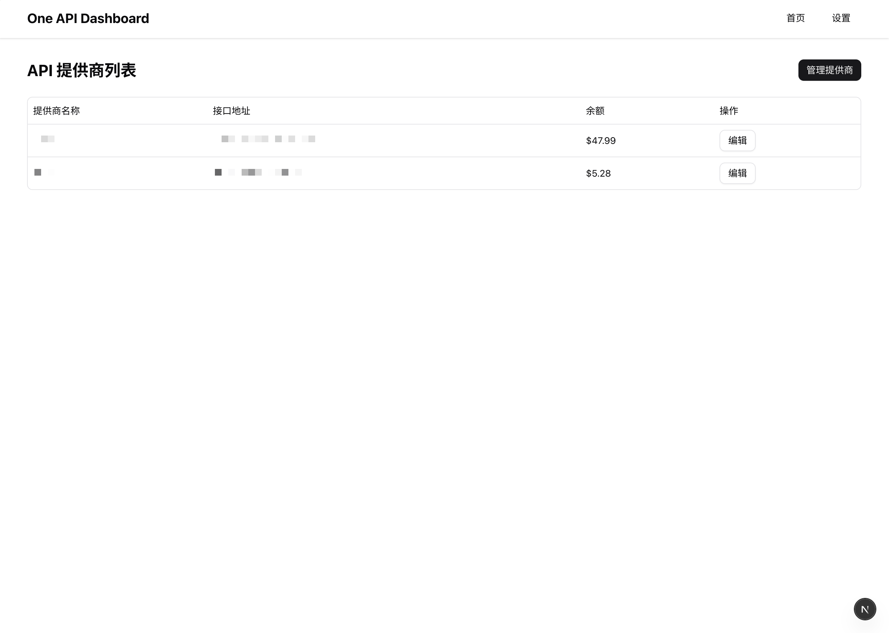

# One API Dashboard

一个简洁、高效的 LLM API 提供商管理工具，帮助您轻松管理多个 LLM API 提供商的配额和使用情况。

## 截图



## 功能特点

- **API 提供商管理**：添加、编辑和删除多个 API 提供商
- **配额监控**：实时查看各 API 提供商的余额和使用情况
- **表格视图**：清晰的表格布局，展示提供商名称、URL、余额等信息
- **导入/导出**：支持配置的 JSON 导入导出，方便备份和迁移

## 技术栈

- **框架**：Next.js 15 (App Router)
- **UI 组件**：Shadcn UI
- **状态管理**：Zustand
- **数据获取**：TanStack Query (React Query)
- **样式**：Tailwind CSS
- **类型检查**：TypeScript
- **通知**：Sonner Toast
- **URL 参数管理**：nuqs

## 快速开始

### 安装依赖

```bash
pnpm install
```

### 启动开发服务器

```bash
pnpm dev
```

访问 [http://localhost:3000](http://localhost:3000) 查看应用。

### 构建生产版本

```bash
pnpm build
pnpm start
```

## 使用指南

### 添加 API 提供商

1. 点击首页或设置页面的「添加」按钮
2. 填写提供商信息（名称、URL、API Key 等）
3. 点击「保存」完成添加

### 查看配额信息

- 首页表格自动显示所有已添加提供商的配额信息
- 支持显示加载状态和错误信息

### 导入/导出配置

- 在设置页面使用「导出」按钮将当前配置导出为 JSON 文件
- 使用「导入」按钮从 JSON 文件恢复配置

## 项目结构

```
src/
├── app/                # Next.js 应用目录
│   ├── api/            # API 路由
│   ├── client.tsx      # 客户端组件
│   ├── layout.tsx      # 布局组件
│   ├── page.tsx        # 首页
│   └── settings/       # 设置页面
├── components/         # 共享组件
│   ├── empty-state.tsx # 空状态组件
│   ├── header.tsx      # 页头组件
│   └── ui/             # UI 组件库
├── lib/                # 工具函数
├── services/           # API 服务
└── store/              # 状态管理
```

## 贡献指南

欢迎提交 Issue 和 Pull Request 来改进这个项目。

## 许可证

MIT
